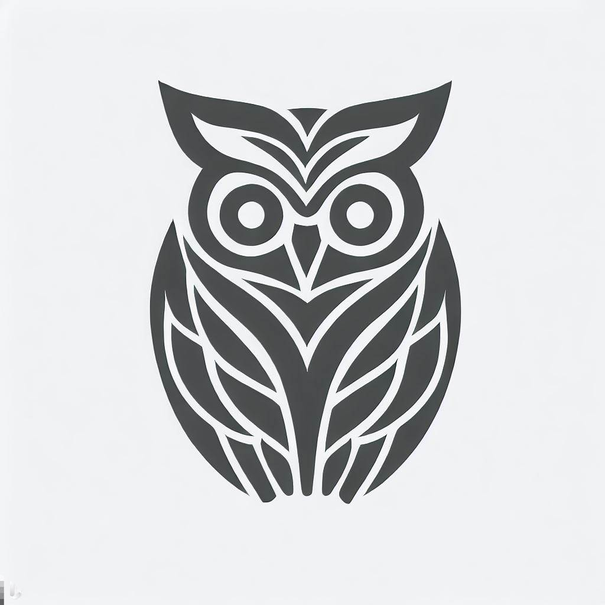

[](https://jhevans.github.io/je-hack-space/)

## Description

An umbrella project for all my personal stuff. Go to the [pages site for more](https://jhevans.github.io/je-hack-space/)

## To do

- [x] Husky for git hooks
- [x] ESLint on commit
- [x] Run E2E on push
- [x] Define what you want to achieve with this
- [ ] Set up Github pages
- [ ] Add link to Github pages in Readme.md
- [ ] Add link to Github pages on application landing page
- [ ] Continue with [first steps](https://docs.nestjs.com/first-steps)

## Goals
Establish a project that you will keep adding to and make use of by:
  - Making it effortless to add to
  - Making it joyful to work with
  - Making it genuinely useful
  - Making it easily extendable

## Principles
- *Working beats good, good enough beats perfect*
  - The goal is always good code but I'm working within constraints and its more valuable to have bad code that does the thing than good code that's never finished. Get it working, then add tasks to refine and get it to good if you like. You're going to get more out of having useful features than refining code to perfection, so when it's 'good enough' move on.
- *Everything in baby steps*
  - I'm going to be time constrained when I'm working with this, I might get half an hour to and hour at a time typically, so I should break down the work into the smallest commits I possibly can so that I'm able to consistently nudge it forward. By maintaining progress it'll be a happier experience to work with it.
- *Making hard things easy beats doing hard things*
  - This is partly a sandbox for testing new techniques and tools that make the development process as a whole smoother. I should do linting, static analysis, hooks, CI etc and do it deliberately and early to catch as many issues as I can before they become issues. Furthermore this should be joyful to work with - so if something is hard and unpleasant, stop doing it and find a better way. 

## Features
- [x] Add AI generated logo
- [ ] Basic blogging capability in Markdown
- [ ] Provide appropriate nudges to document stuff (see [ADR 001 - Use ADRs](./docs/adr/001%20-%20Use%20ADRs))
- [ ] Widget showing current [Carbon intensity](https://carbon-intensity.github.io/api-definitions/#carbon-intensity-api-v2-0-0)
- [ ] Functional and aesthetically pleasing UI
- [ ] Private posts
- [ ] Cloud hosting


## Installation

```bash
$ npm install
```

## Running the app

```bash
# development
$ npm run start

# watch mode
$ npm run start:dev

# production mode
$ npm run start:prod
```

## Test

```bash
# unit tests
$ npm run test

# e2e tests
$ npm run test:e2e

# test coverage
$ npm run test:cov
```

## Support

Nest is an MIT-licensed open source project. It can grow thanks to the sponsors and support by the amazing backers. If you'd like to join them, please [read more here](https://docs.nestjs.com/support).

## Stay in touch

- Author - [Kamil Myśliwiec](https://kamilmysliwiec.com)
- Website - [https://nestjs.com](https://nestjs.com/)
- Twitter - [@nestframework](https://twitter.com/nestframework)

## License

Nest is [MIT licensed](LICENSE).
